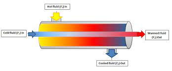
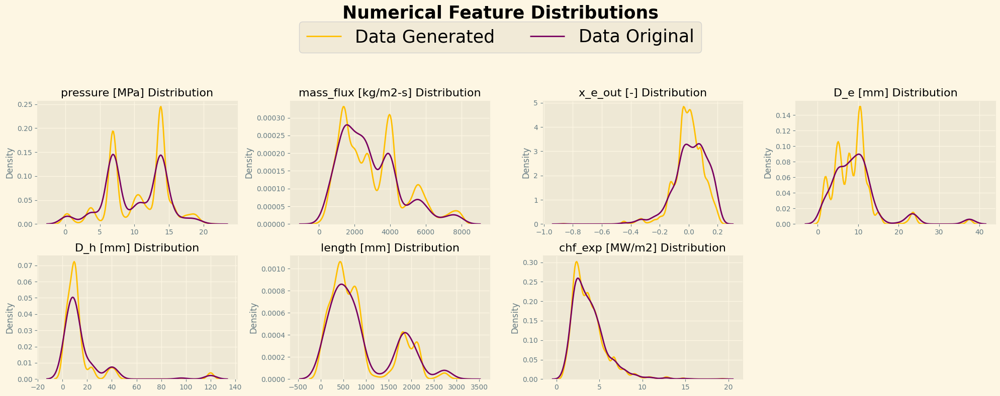
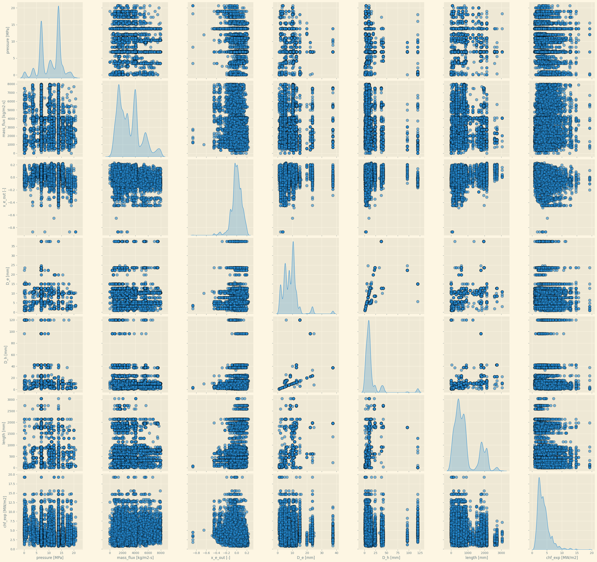
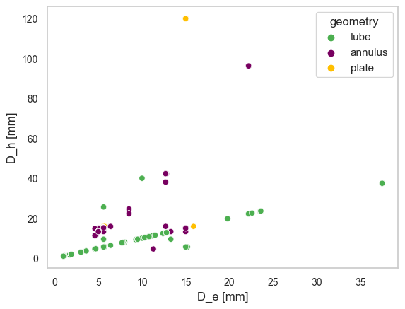
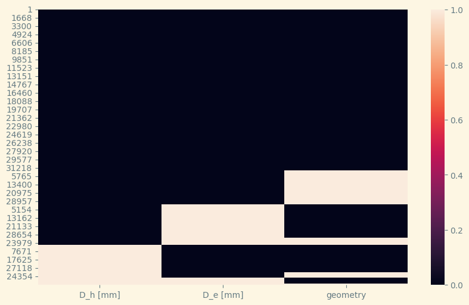
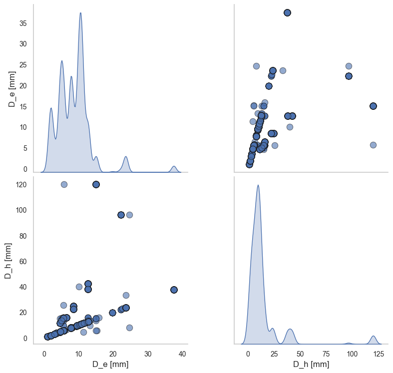
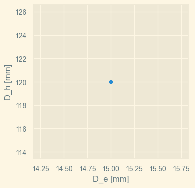
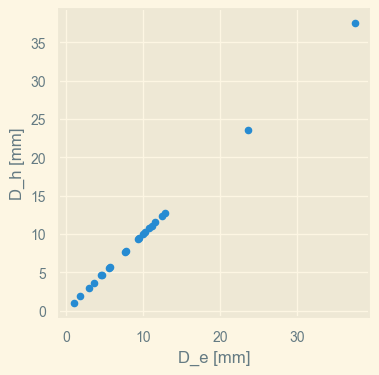
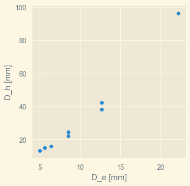
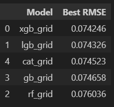

# **Feature Imputation with a Heat Flux Dataset🧩🌡️**

¡Hola! 👋 En este proyecto de Kaggle, me enfrenté al desafío de tratar valores faltantes en un dataset de 10 columnas y 31644 filas, procedente de otro dataset de 1865 filas y las mismas columnas.
Permíteme resumirte cómo abordé el problema y resolví la imputación de missing values utilizando diferentes técnicas; así como los modelos de aprendizaje automático que utilicé para predecir la variable objetivo. ¡Comencemos! 🚀

**📝 Breve descripción del proyecto:**

Este trabajo se enfoca en predecir la máxima cantidad de calor que puede transferirse en sistemas de ebullición antes de que ocurran problemas. 🚫😓

 Utiliza una combinación de conocimiento experto y técnicas de aprendizaje automático para mejorar las predicciones.  🤖

 Se analizan diferentes variables, como la geometría del sistema y la presión, para desarrollar un modelo preciso. 

 El objetivo es utilizar estos datos para diseñar sistemas de calentamiento más seguros y eficientes en diferentes industrias.

 
## **💡 Resolución del problema:**

El dataset consta de columnas categóricas y numéricas, con una columna objetivo llamada "x_e_out [-]". Se observó que todas las columnas tenían valores nulos, excepto "chf_exp [MW/m2]". El porcentaje de valores nulos en las columnas rondaba el 15%.

## **🛠️ Proceso de imputación de valores faltantes:**

Sabemos que existe un dataset original con 1865 entradas y las mismas columnas. Por lo tanto, podemos usarlo como referencia para imputar los valores faltantes en el dataset de 31644 filas; ya que hemos comprobado que el dataset generado contiene al original como subconjunto.

**Cuando las variables no siguen una correlación lineal clara, imputar los valores nulos con medidas de estadística descriptiva puede introducir sesgos en los datos imputados.​**

**Excepto por las columnas ``D_e [mm]`` y ``D_h [mm]``, las demás no siguen una correlación lineal clara. Por lo tanto, no podemos imputar los valores faltantes con medidas de estadística descriptiva.**

**1️⃣🔹 Columnas categóricas (author y geometry):**

Utilicé el valor más frecuente ``(moda)`` para imputar los valores faltantes en estas columnas. A través de un pipeline, apliqué SimpleImputer con la estrategia 'most_frequent' para reemplazar los valores nulos.
Sin embargo, para los valores faltantes de ``geometry`` en los que existía información de las columnas ``D_h [mm]`` y ``D_e [mm]``, utilicé la siguiente lógica:

* **Cuando 'geometry' es 'tube', los valores de 'D_e [mm]' y 'D_h [mm]' son iguales.**

* **Cuando 'geometry' es 'annulus', los valores de 'D_h [mm]' son generalmente mayores que los valores de 'D_e [mm]'.**

* **Para la categoría 'plate', solo hay un caso registrado y los valores de 'D_h [mm]' y 'D_e [mm]' son iguales.** (15, 120)
  

**Mediante esta matriz de nulos, imputamos los valores nulos de ``geometry`` para ``D_h [mm]`` y ``D_e [mm]`` informados usando la lógica anterior.**

**2️⃣Columnas numéricas no correlacionadas linealmente:**

Para las columnas numéricas no linealmente correlacionadas: ``pressure [MPa]``, ``mass_flux [kg/m2-s]``, y ``length [mm]``, implementé **``KNN (K-Nearest Neighbors)``** para la imputación. Usando otro pipeline, configuré KNNImputer con 5 k-vecinos más cercanos y pesos uniformes para reemplazar los valores faltantes.

 **3️⃣Columnas numéricas correlacionadas linealmente:**

Nos hemos fijado en el patrón que siguen los datos del dataset original y generado y son iguales. 

Por lo tanto, podemos utilizar esta información para imputar los valores faltantes en las columnas numéricas correlacionadas linealmente:
``D_e [mm]`` y ``D_h [mm]``

#### **📝 Geometry == 'plate'** ➡️ (``D_e [mm]``=15; ``D_h [mm]`` = 120)

#### **📝 Geometry == 'tube'** ➡️ (``D_e [mm]``=``D_h [mm]``)

 

#### **📝 Geometry == 'annulus'** ➡️ (``D_e [mm]``<``D_h [mm]``)

### ✅ D_h [mm] = k * D_e [mm] ➡️ Regresión Lineal
Hemos calculado el valor de k mediante la regresión lineal de las columnas ``D_e [mm]`` y ``D_h [mm]`` en el dataset original.
Entrenamos en el modelo original e imputamos en el generado

### ✅ D_e [mm] = a + b * D_h [mm] ➡️ Regresión Lineal Inversa
Hemos calculado los valores de a y b mediante la regresión lineal inversa de las columnas ``D_e [mm]`` y ``D_h [mm]`` en el dataset original. Impusimos los valores en el dataset generado.

### ✅ D_e [mm] y D_h [mm] = null ➡️ KNN
Para los valores faltantes de ``D_e [mm]`` y ``D_h [mm]``, utilicé nuevamente KNNImputer con 5 k-vecinos más cercanos y pesos uniformes para reemplazar los valores faltantes.

**4️⃣Columnas numéricas no linealmente correlacionadas (K-NN):**
``pressure [MPa]``, ``mass_flux [kg/m2-s]``, y ``length [mm]``

## 🤖MODELADO ENSEMBLE

**XGBRegressor**

**LightGBoostRegresor**

**CatBoostRegressor**

**GradientBoostingRegressor**

**RandomForestRegressor**

**``Mejor modelo``:** 

**``XGBRegressor``**

